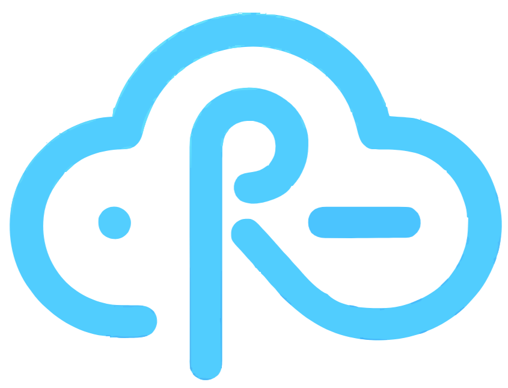

  

  

---

## 🌟 Présentation

**Ryvie** est un **OS + une plateforme** qui transforme n'importe quelle machine (mini‑PC, serveur, etc.) en un **cloud personnel** puissant et simple à utiliser. 

L'objectif est d'offrir une page d'accueil de type **"launcher"** (style iOS 📱) pour lancer et administrer vos services (apps Docker) en toute fluidité :

- **🖥️ Launcher en grille** : Organisation intuitive des apps + widgets personnalisables.
- **📦 Gestion centralisée** : Détection automatique des apps (manifests, icônes, ports).
- **🎨 Préférences utilisateur** : Customisation complète (layout, fond d’écran, thèmes).
- **🌐 Connexion P2P intégrée** : Accès distant sécurisé sans configuration réseau complexe.
- **🔒 Accès flexible** : Mode local ou distant selon vos besoins (public/privé).

---

## 🚀 Fonctionnalités

- **Grid Launcher** : Interface responsive, drag & drop, et widgets (météo, CPU/RAM, stockage...).
- **P2P Ready** : Accès à vos données partout dans le monde, simplement.
- **App Catalog** : Détection dynamique des applications via manifests générés.
- **Cloud Sync** : Sauvegarde de vos préférences par utilisateur côté backend.
- **Real-time Monitoring** : Backend réactif via Socket.IO pour un état du système toujours à jour.

---

## 💻 Installation (utilisateur final)

1. **Télécharger et installer l’OS Ryvie** 💿
   - Téléchargez l’image/installeur fourni.
   - Installez l’OS sur la machine hôte.

2. **Télécharger le client Ryvie** 📥
   - Rendez-vous sur [ryvie.fr](https://ryvie.fr).
   - Téléchargez le **client Ryvie** adapté à votre système.
   - Connectez-vous à votre instance.

3. **Accéder à l’interface** 🎉
   - Gérez vos apps, organisez votre grille et personnalisez votre espace !

---

## 🏗️ Développement & Architecture

### Architecture du Repo 🛠️

  

- **Backend** (`Ryvie-Back/`) : API Express, Socket.IO, authentification LDAP + JWT.
- **Frontend** (`Ryvie-Front/`) : React 18 + Electron pour une expérience fluide.
- **Données** (`/data/`) : Configuration, manifests d'apps et stockage utilisateur.

### 📋 Prérequis
- **CPU** : 4 cœurs minimum 
- **RAM** : 8 Go minimum (**16 Go recommandé**) 
- **Stockage** : 50 Go minimum 

---

## 🤝 Contributing

Les contributions sont les bienvenues ! ❤️

- **Issues** : Signalez un bug ou proposez une idée avec un maximum de détails.
- **Pull requests** : Créez une branche dédiée et expliquez clairement vos modifications.

---

## ⚠️ Disclaimer

Ce projet est fourni **"tel quel"**, sans garantie d'aucune sorte. L'équipe Ryvie ne pourra pas être tenue responsable des dommages, pertes de données ou indisponibilités résultant de l'utilisation de la plateforme.

---

## 👥 Authors

* **Jules Maisonnave** ([@maisonnavejul](https://github.com/maisonnavejul)) - *Initial work & Lead Development* 
* **Driss Bendahan** ([@thegreenprogrammer](https://github.com/thegreenprogrammer)) - *Infrastructure & DevOps* 
* **Paul Quiquempois** ([@Loghin01](https://github.com/Loghin01)) - *Development & CI/CD* 

  Fait avec ❤️ par l'équipe Ryvie.

