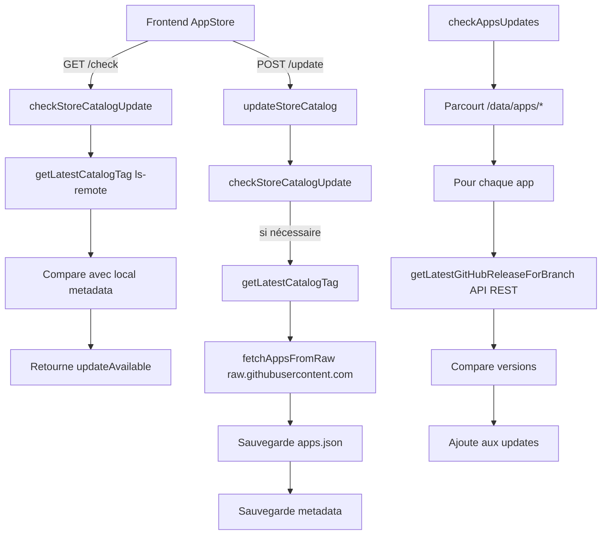

# Flux de mise à jour de l’App Store (Ryvie)

## Vue d’ensemble

Le système de mise à jour de l’App Store Ryvie suit deux flux distincts :
1. **Mise à jour du catalogue d’applications** (`ryvieos/Ryvie-Apps`)
2. **Mise à jour des applications installées** (dépend de chaque repo d’application)

---

## 1. Mise à jour du catalogue d’applications

### 1.1 Déclenchement (Frontend)

**Fichier** : `/opt/Ryvie/Ryvie-Front/src/pages/AppStore.tsx`

- **Bouton “Vérifier les mises à jour”**
  - Appelle `checkForUpdates()` → `GET /api/appstore/check`
  
- **Bouton “Mettre à jour le catalogue”**
  - Appelle `updateCatalog()` → `POST /api/appstore/update`

### 1.2 Routes (Backend)

**Fichier** : `/opt/Ryvie/Ryvie-Back/routes/appStore.ts`

```typescript
// GET /api/appstore/check
router.get('/appstore/check', verifyToken, async (req, res) => {
  const update = await checkStoreCatalogUpdate();
  res.json(update);
});

// POST /api/appstore/update
router.post('/appstore/update', verifyToken, async (req, res) => {
  const result = await updateStoreCatalog();
  res.json(result);
});
```

### 1.3 Vérification de la mise à jour

**Fichier** : `/opt/Ryvie/Ryvie-Back/services/updateCheckService.ts`

```typescript
async function checkStoreCatalogUpdate() {
  // 1. Récupère la dernière release via ls-remote (sans API REST)
  const latestTag = getLatestCatalogTag();
  
  // 2. Charge les métadonnées locales
  const localMetadata = await appStoreService.loadMetadata();
  
  // 3. Compare les tags
  const currentTag = localMetadata.releaseTag;
  
  const updateAvailable = currentTag !== latestTag;
  
  return {
    updateAvailable,
    currentVersion: currentTag,
    latestVersion: latestTag
  };
}
```

### 1.4 Récupération de la dernière release (Git ls-remote)

**Fichier** : `/opt/Ryvie/Ryvie-Back/services/updateCheckService.ts`

```typescript
function getLatestCatalogTag() {
  // Utilise git ls-remote (ne consomme pas le quota)
  const out = execSync('git ls-remote --tags --refs https://github.com/ryvieos/Ryvie-Apps.git');
  const tags = out
    .split('\n')
    .map(l => (l.split('\t')[1] || '').replace('refs/tags/', '').trim())
    .filter(Boolean);
  
  // Filtre les tags SemVer et trie
  const versionTags = tags.filter(t => /^v?\d+(\.\d+){1,3}(-[0-9A-Za-z.+-]+)?$/.test(t));
  const sorted = versionTags.sort(compareVersions);
  
  return sorted[sorted.length - 1] || null; // le plus récent
}
```

**Avantages** :
- **0 requête** consommée sur le quota GitHub (pas d'API REST)
- **Rapide** et léger (pas de parsing JSON)
- **Robuste** (pas de rate limit)

### 1.5 Mise à jour effective

**Fichier** : `/opt/Ryvie/Ryvie-Back/services/updateService.ts`

```typescript
async function updateStoreCatalog() {
  // 1. Vérifie si une mise à jour est nécessaire
  const checkResult = await checkStoreCatalogUpdate();
  
  if (!checkResult.updateAvailable) {
    return { success: true, updated: false };
  }
  
  // 2. Télécharge apps.json depuis l’asset de la release
  const release = await appStoreService.getLatestRelease();
  const apps = await appStoreService.fetchAppsFromRelease(release);
  
  // 3. Sauvegarde localement
  await appStoreService.saveAppsToFile(apps);
  await appStoreService.saveMetadata({ releaseTag: release.tag });
  
  return { success: true, updated: true, version: release.tag };
}
```

---

## 2. Mise à jour des applications installées

### 2.1 Déclenchement

**Fichier** : `/opt/Ryvie/Ryvie-Back/services/updateCheckService.ts`

```typescript
async function checkAppsUpdates() {
  // Parcourt toutes les apps installées dans /data/apps/
  const apps = fs.readdirSync(APPS_DIR).filter(...);
  
  for (const appFolder of apps) {
    // Pour chaque app, compare la version locale avec la distante
    const update = await checkAppUpdate(appFolder);
    updates.push(update);
  }
}
```

### 2.2 Vérification pour une application

```typescript
async function checkAppUpdate(appFolder) {
  // 1. Lit le manifest local
  const manifest = getAppManifest(appPath);
  
  // 2. Extrait owner/repo depuis le manifest
  const { owner, repo } = parseRepository(manifest.repository);
  
  // 3. Récupère la version locale
  const currentVersion = getAppCurrentVersion(appPath);
  
  // 4. Récupère la dernière release distante (API REST)
  const latestVersion = await getLatestGitHubReleaseForBranch(owner, repo, branch);
  
  // 5. Compare
  const status = compareVersions(currentVersion, latestVersion);
  
  return {
    name: manifest.name,
    currentVersion,
    latestVersion,
    updateAvailable: status === 'update-available'
  };
}
```

---

## Schéma du flux



---

## Points de consommation du quota GitHub API

1. **Catalogue d'applications** : **0 requête** (utilise `git ls-remote` + `raw.githubusercontent.com`)

2. **`getLatestGitHubReleaseForBranch()`** (par app)
   - `GET /repos/{owner}/{repo}/releases?per_page=1`
   - Consomme 1 requête par application installée

3. **`getLatestGitHubTag()`** (fallback)
   - `GET /repos/{owner}/{repo}/tags`
   - Consomme 1 requête si utilisé

---

## Optimisations envisagées

### Remplacer l’API REST par Git + Raw

1. **Pour le catalogue** ✅ **DÉJÀ FAIT** :
   - `getLatestRelease()` remplacé par `git ls-remote --tags` (0 quota)
   - `fetchAppsFromRelease()` à remplacer par `curl https://raw.githubusercontent.com/ryvieos/Ryvie-Apps/{tag}/apps.json`

2. **Pour les applications** :
   - Utiliser `git ls-remote --tags` sur chaque repo d’application
   - Comparer les tags sans appeler l’API REST

### Avantages
- **Zéro consommation** du quota GitHub (60/h sans token)
- **Plus rapide** (pas de parsing JSON complexe)
- **Plus robuste** (pas de rate limit)

---

## Fichiers clés

| Fichier | Rôle |
|---------|------|
| `Ryvie-Front/src/pages/AppStore.tsx` | Interface et déclenchement |
| `Ryvie-Back/routes/appStore.ts` | Routes API |
| `Ryvie-Back/services/updateCheckService.ts` | Logique de vérification |
| `Ryvie-Back/services/updateService.ts` | Logique de mise à jour |
| `Ryvie-Back/services/appStoreService.ts` | Accès GitHub et gestion locale |

---

## Étapes typiques de mise à jour du catalogue

1. **Utilisateur clique “Mettre à jour”**
2. **Frontend** → `POST /api/appstore/update`
3. **Backend** :
   - Vérifie si une mise à jour est disponible (`checkStoreCatalogUpdate`)
   - Si oui :
     - Appelle l’API GitHub pour obtenir la dernière release
     - Télécharge `apps.json` depuis l’asset
     - Sauvegarde localement
     - Met à jour les métadonnées
4. **Frontend** :
   - Reçoit la réponse
   - Recharge la liste des apps
   - Affiche le nouveau statut

---

## Étapes typiques de mise à jour d’une application

1. **Système vérifie périodiquement** (`checkAppsUpdates`)
2. **Pour chaque app installée** :
   - Lit le `ryvie-app.yml` local
   - Extrait le repo GitHub
   - Compare la version locale avec la dernière release
   - Détecte si une mise à jour est disponible
3. **Résultat** :
   - `updateAvailable: true/false` dans l’interface
   - Bouton “Mettre à jour” activé si nécessaire
